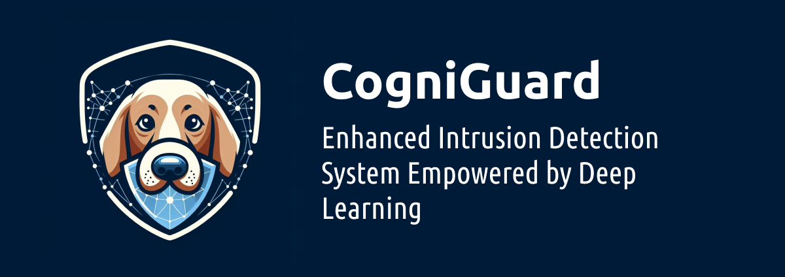
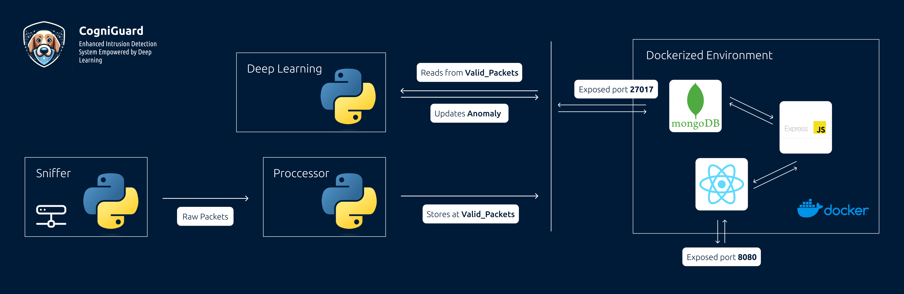

# CogniGuard



## Overview
CogniGuard is an Intrusion Detection System (IDS) fortified with deep learning techniques, utilizing the NSL-KDD dataset for training and evaluation.

## Architecture
CogniGuard IDS employs a deep learning architecture tailored for efficient analysis of network traffic and intrusion detection. Here's an overview of its architecture:


## Installation
To install and run CogniGuard on your system, follow these steps:

1. **Clone the Repository**: 
    ```bash
    git clone git@github.com:Eljakani/deeplearning-ids.git
    ```
   
2. **Run Setup Script**:
    ```bash
    ./setup.sh
    ```

3. **Start the IDS**:
    ```bash
    sudo ./run.sh
    ```
    Note: Ensure to run as a superuser, as the sniffing process requires elevated access.

## Monitoring 
You can monitor and observe the detected anomalies via the web interface at http://<your_ip>:8080.

## Contributors
- [El Jakani Yassine](https://github.com/eljakani)
- [Saad Benmouya](https://github.com/SaadBenmouya)
- [El Assri El Mahdi](https://github.com/Pegasus070)
- [Essaleh Yassine](https://github.com/Yassinom)
- [El Motassadeq Moad](https://github.com/moadza)
- [Assiri Abdelhakim](https://github.com/hakimziyach)
- [Stoti Mehdi](https://github.com/SMBullet)
- [Adnane Boughazi](https://github.com/shadowknight03)